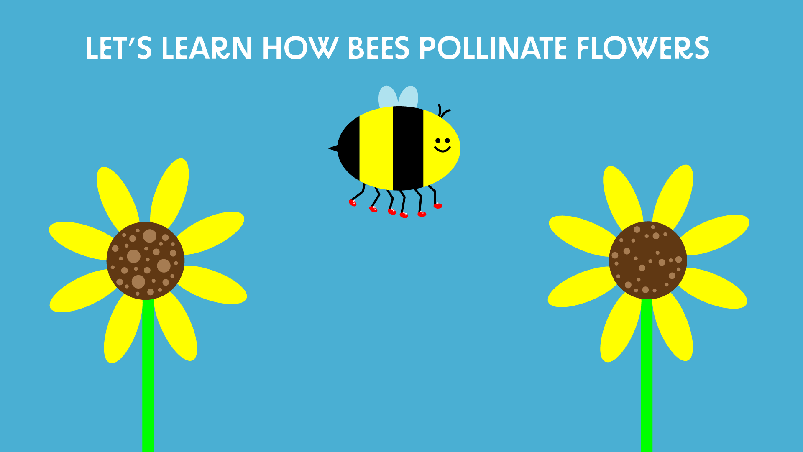
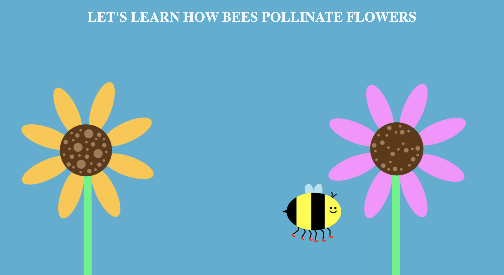
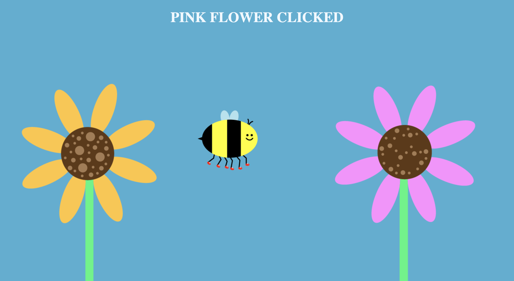
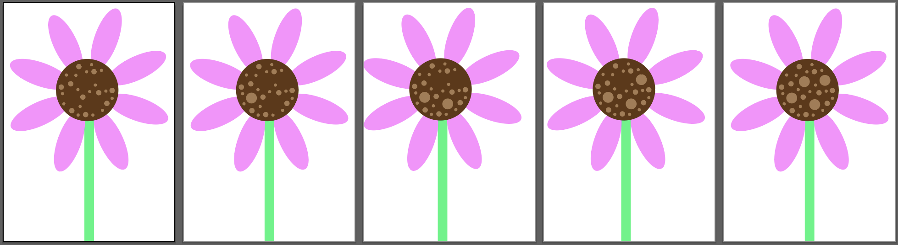
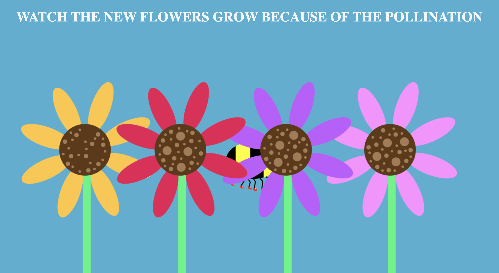

# Milestone 1

For my project I am going to create an information infographic/web experience about the role of bees in pollination and the outcome of this process. I have always been very passionate about saving the bees and dedicated many high school presentations and projects to this topic. It is my go to topic when I am initially unsure of what to focus on, and I never find a lack of passion when researching and communicating the importance of bees. For this web experience, I want to focus on educating children and keeping my explanation simple yet fun and interactive. Part of the reason my audience is children is because it will be much easier to focus on explaining the big picture of pollination in an infographic/web experience rather than the smaller more scientific aspects. Additionally, my graphic design style caters more toward children as I use fun colors, large blocky shapes, and expressive faces. My whole life I have doodled bees wearing little red sneakers (a testament to my obsession with bees) and therefore the bee in this infographic will be wearing sneakers.

My infographic will allow the user to play the role of the bee and bring pollen from one flower to another and watch more flowers grow. They will be instructed on how to complete the process and will not be able to move on unless they follow the steps. Their cursor will be connected to the bee, therefore where ever they move their cursor is where the bee will fly.

This wireframe, made on Adobe Illustrator is a low fidelity mockup of the page set up of my infographic. I want the site to be super minimal, highlighting primary colors, and giving the essence of a children’s book. One flower will already have 4 larger pollen dots that when clicked on will be transferred to the bee who will fly over to the other flower and click on it to transfer the pollen. Once the pollen is successfully transferred the new flowers will grow. The text at the top of the screen will give the user instructions such as “Click on the left flower to collect its pollen”.

This project is not possible without the implementation of JavaScript. I will use multiple event listeners to react on screen clicks, html changes, and mouse movements. Because this web experience will be entirely interactive, it will not move on until the user takes action. JavaScript will be used to make this infographic possible, which I would claim is a pretty significant enhancement.

In my research for this project I have referenced multiple source about pollination and bees. I have mainly been looking at sources intended for kids to exemplify the type of communication my infographic will take on. 

[https://www.coolkidfacts.com/pollination-for-kids/](https://www.coolkidfacts.com/pollination-for-kids/)

[https://www.keepingbackyardbees.com/the-role-of-nectar-honey-and-pollen-in-the-hive/](https://www.keepingbackyardbees.com/the-role-of-nectar-honey-and-pollen-in-the-hive/)

[https://www.ypsilibrary.org/2020/06/bees/](https://www.ypsilibrary.org/2020/06/bees/)

I will also be look scouring the web during my coding process to find all things JavaScript. I have worked with JavaScript but never to this scale, where the JavaScript will be tracking coordinates and triggering objects to move around the screen.

My plan for making this website responsive is to shorten the blue space in the middle of the flowers for different screen sizes. On a large screen the flowers will be farther apart and the user will have to move the mouse farther. However, on a smaller screen the flowers will be smaller and a lot closer together so they are able to fit on the screen.

My specific goals are listed below in list format: 
- Prototyping/proof of concept
    - image following the mouse
    - animation triggered by JavaScript
    - text instructions only moving forward once user has complete an action.
- MVP (Minimum Viable Product)
    - bee is the cursor
    - when you click on the first flower the dots that represent pollen disappear
    - when you click on the second flower the dots appear
    - one dot at a time (3-4) or not one at a time (that is a decision I have to make)
    - text at the top with instructions → based on the step the user is on
    - once four dots are on the second flower, more flowers grow from its roots
    - call to action at the end
        - save the bees or we won’t have any flowers! (or other necessary plants)
    - restart button
- Stretch goals
    - bee moves directions based on the direction the mouse is moving
    - zoom in on the first flower to show the dots close up
    - zoom in second flower to describe the male and female parts of the flower
    - smooth transitions on these screen changes
    - roots animation showing them connecting when more flowers grow

# Milestone 2

For this milestone, I prototyped my project and proved the core functionality indeed works. Luckily, my prototyping process went smooth enough that I was able to build on my prototype and actually start making a final product. 
The first thing I did was figure out how to make the bee move with the users mouse. I found this resource online that laid out the code in a really simple and straightforward way.
[Check it out!](https://levelup.gitconnected.com/use-javascript-to-make-an-element-follow-the-cursor-3872307778b4)

I thought this feature of my project would be super complicated and hard to figure out, but it was very simple and easy. This ease of coding right at the beginning of my project gave me a confidence boost and got me started off on the right foot. 

The next thing I did was change the color of the flowers in my wireframe. Originally I had two yellow flowers and was going to refer to them as “the left flower” and “the right flower”. However, I wanted to add more color to my design and with my target audience in mind, I realized that young children might not know their lefts and rights yet (I sometimes even get them mixed up!). Once I added in the text on the top, my site looked just like my wireframe that I made for milestone 1.

*Wirefram recreated in HTML and CSS - off to a good start*

All of the graphics in my project were created on adobe illustrator, exported as a png, and placed in my project. The flowers are placed using absolute position. I am not sure if this is the best, most responsive, way to place the flower, but I am going with it for now and will adjust if I run into problems (wish me luck!). 

I played around with the Javascript, prototyping the text changing, displaying different instructions when the flowers are clicked. I only want the text to change when the center of the flower is clicked, right now it is changing when any part of the flower is clicked. This is on my fixer-upper to do list.

*Prototyping with Javascript - so fun and cool*

I needed to figure how to change the number of dots when the user clicks on the flowers. Don’t be mad at me, but I made 5 different version of each flower with varying amounts of dots. This method has already caused me issues (i.e. the flowers moving ever so slightly when clicked) and makes my code look terrifying, but I am rolling with it for now and will make it better if I can figure out how.

*Remaking the flowers - don't judge me*

I have a few setTimeout features implemented at this point, to control the flow of the experience. However, I need to play around with it more and see if this is the best option for my project. For example, these new flowers pop in after 1 second of the user completing the last step.

*New flowers grew - yay!*

Note: I know the bee is behind the flowers, I am going to fix this don’t worry!

Overall, this project has been super fun and interesting so far. I have so many ideas that I need to contain to my stretch goals (i.e. text animation, sound effects, background music). I will reach my MVP once I fix all of the little bugs and implement a strict order of operations that the user cannot break.

Here is my revised list of goals: 

- Prototyping/proof of concept
    - image following the mouse
    - dots added/subtracted on click
    - text instructions only moving forward once user has complete an action.
- MVP (Minimum Viable Product)
    - bee is the cursor
    - when you click on the first flower the dots that represent pollen disappear
    - when you click on the second flower the dots appear
    - pick up one dot at a time (4) then place down one dot at a time (4)
    - text at the top with instructions → based on the step the user is on
    - once four dots are on the second flower, more flowers grow from its roots
    - call to action at the end
        - save the bees or we won’t have any flowers! (or other necessary plants)
    - restart button
- Stretch goals
    - bee moves directions based on the direction the mouse is moving
    - sound effects
    - text animates in
    - letters move when bee flies over them  
    - background music
    